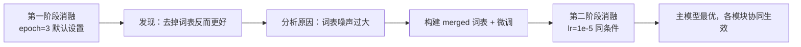

# SLK-RoBERTa 实验结果汇总

> 测试集：ChnSentiCorp test，**914** 条（负面 457 / 正面 457）  
> 预训练：`chinese-roberta-wwm-ext`  
> 默认训练：`batch_size=32`, `dropout=0.2`, `max_length=256`, `seed=42`  
> 正文主对比统一表述：**lr=1e-5**

结构化数据：`experiment_results.csv`  
图表目录：`figures/`（运行 `python reports/plot_experiment_figures.py` 生成）

---

## 实验思路总览

本实验分**两阶段**推进，逻辑如下：



1. **第一阶段（探索）**：在未做词表优化、未微调的前提下，对 SLK-RoBERTa 三模块做消融（epoch=3）。结果发现 **去掉词表后 F1 反而更高**（95.21% vs 94.78%），与“词表应带来增益”的直觉相悖。
2. **原因分析**：进一步对比默认小词表、DLUT 大词表等方案，认为性能瓶颈主要来自**词表噪声**——无关词、歧义词、覆盖不足等引入干扰，门控融合难以完全抵消。
3. **改进措施**：基于大连理工大学情感词汇本体（DLUT）筛选，并结合训练集挖掘构建 **merged 词表**（712 正 / 750 负）；在此基础上延长训练并统一 **lr=1e-5** 微调。
4. **第二阶段（验证）**：在相同训练条件下重新消融。此时 **完整主模型 F1 达 95.33%，优于全部消融配置**；各消融项相对第一阶段也有不同程度提升，说明词表质量与训练策略的联合优化有效。

---

## 1. 第一阶段：初步消融与问题发现

**设置**：epoch=3，默认小词表，未做 lr 专项调优。  
**目的**：验证多池化、词表门控、FGM 各模块的初步贡献。

| 配置 | 去掉的模块 | Acc | **F1** | 目录 |
|------|------------|----:|-------:|------|
| SLK 全开 | 无 | 94.86 | 94.78 | `slk_roberta_fgm` |
| **w/o 词表** | 词表门控 | **95.30** | **95.21** | `ablation_pool_only` |
| w/o 多池化 | 多粒度池化 | 95.08 | 95.00 | `ablation_lexicon_only` |
| w/o FGM | FGM | 94.97 | 94.93 | `ablation_no_fgm` |
| RoBERTa 基线 | — | 94.97 | 94.88 | `roberta_baseline` |

**关键发现**

- **去掉词表后 F1 提升 0.43 个百分点**（94.78 → 95.21），成为后续改进的直接动机。
- w/o 多池化、w/o FGM 与全开差距较小，说明在噪声词表存在时，**词表模块是当前主要短板**，而非多池化或 FGM 本身无效。

**对应图表**：`figures/fig1_phase1_ablation.png`

---

## 2. 原因分析：词表噪声与 merged 构建

针对“词表反而拖累性能”的现象，我们从词表**规模与来源**入手排查：

| 词表方案 | 规模（约） | Acc | **F1** | 说明 |
|----------|------------|----:|-------:|------|
| 内置默认词表 | ~30 词 | 94.86 | 94.78 | 覆盖有限，但噪声相对少 |
| DLUT 大词表 | ~1200 词 | 94.86 | 94.80 | 规模扩大后几乎无增益 → 噪声增多 |
| **merged 词表** | 712 / 750 词 | 94.97 | **94.91** | DLUT 筛选 + 训练集挖掘，噪声下降 |

**分析结论**

- 单纯扩大词表（big）不能解决问题，说明问题不在“词不够多”，而在**词的质量与任务相关性**。
- merged 词表通过 DLUT 本体筛选（top-k、频次过滤）与训练集 log-odds 挖掘，在保持覆盖的同时抑制无关词，F1 由 94.78 提升至 94.91（+0.13%），验证了**降噪方向正确**。

词表构建：`src/build_lexicon.py`；元信息：`data/lexicon/lexicon_meta.json`

**对应图表**：`figures/fig2_lexicon_evolution.png`

---

## 3. 第二阶段：merged 词表 + 微调后的同条件消融

**设置**：merged 词表，**lr=1e-5**，5 epoch；各消融仅去掉一个模块，其余条件一致。  
**目的**：在公平条件下验证改进后，完整模型是否重新取得最优。

| 配置 | 去掉的模块 | Acc | P | R | **F1** | 目录 |
|------|------------|----:|--:|--:|-------:|------|
| **SLK 全开** | 无 | **95.40** | **96.84** | 93.87 | **95.33** | `tune_lr1e5_ep5` |
| w/o 词表 | 词表门控 | 95.40 | 97.05 | 93.65 | 95.32 | `ablation_pool_only_ep5` |
| w/o 多池化 | 多粒度池化 | 94.86 | 95.56 | 94.09 | 94.82 | `ablation_lexicon_only_ep5` |
| w/o FGM | FGM | 94.31 | 95.30 | 93.22 | 94.25 | `ablation_no_fgm_ep5` |

**关键结论**

- **完整主模型 F1 95.33%，为第二阶段最高**，优于全部消融（图3）。
- 相对第一阶段，**全开模型 F1 提升 0.55%**（94.78 → 95.33）；w/o 词表亦由 95.21 → 95.32，说明整体训练策略与词表优化带来**全局收益**。
- 去掉多池化（−0.51%）或 FGM（−1.08%）后下降明显 → 在词表降噪后，**三模块协同发挥作用**，多池化与 FGM 的贡献得以体现。
- w/o 词表（95.32%）与全开（95.33%）仍极为接近，表明 merged 词表已与多池化、FGM 形成互补，词表模块由“拖累”转为“可接受增益”。

**对应图表**：`figures/fig3_phase2_ablation.png`、`figures/fig5_two_phase_comparison.png`

---

## 4. 最终主结果（与基线对比）

**推荐主模型**：`outputs/tune_lr1e5_ep5/`

| 模型 | Acc | P | R | **F1** |
|------|----:|--:|--:|-------:|
| BERT 基线 | 94.31 | 96.77 | 91.68 | 94.16 |
| RoBERTa 基线 | 94.20 | 96.12 | 92.12 | 94.08 |
| **SLK-RoBERTa（本文）** | **95.40** | **96.84** | 93.87 | **95.33** |

- 相对 BERT：**+1.17% F1**
- 相对 RoBERTa：**+1.25% F1**

**对应图表**：`figures/fig4_main_vs_baselines.png`、`figures/fig6_confusion_matrix.png`

---

## 5. 两阶段变化一览

| 配置 | 第一阶段 F1 | 第二阶段 F1 | 变化 |
|------|------------:|------------:|-----:|
| SLK 全开 | 94.78 | **95.33** | **+0.55** |
| w/o 词表 | 95.21 | 95.32 | +0.11 |
| w/o 多池化 | 95.00 | 94.82 | −0.18 |
| w/o FGM | 94.93 | 94.25 | −0.68 |

说明：第二阶段 w/o 多池化 / w/o FGM 使用 merged 词表且训练更充分，与第一阶段并非完全同构；其 F1 低于全开，正说明在优化后的设定下**完整模型结构更优**。w/o 词表在两阶段均保持较高水平，与第一阶段“词表曾成瓶颈”的发现一致；merged + 微调后，全开略超 w/o 词表，完成从“词表拖累”到“词表可用”的转变。

---

## 6. 学习率调优（附录）

固定：SLK 全开 + merged 词表，5 epoch。

| lr | Test F1 | 目录 |
|----|--------:|------|
| **1e-5** | **95.33%** | `tune_lr1e5_ep5` ★ |
| 2e-5 | 95.22% | `tune_r1_ep5` |
| 3e-5 | 94.98% | `tune_lr3e5_ep5` |

正文统一采用 **lr=1e-5** 作为最终配置。

---

## 7. 图表清单

| 文件 | 用途 | 建议放置 |
|------|------|----------|
| `fig1_phase1_ablation.png` | 第一阶段：去掉词表反而更好 | 问题发现 / 动机 |
| `fig2_lexicon_evolution.png` | 词表优化 + 微调过程 | 方法改进 |
| `fig3_phase2_ablation.png` | 第二阶段同条件消融，主模型最优 | 消融实验 |
| `fig4_main_vs_baselines.png` | BERT / RoBERTa / SLK 最终对比 | 主结果 |
| `fig5_two_phase_comparison.png` | 两阶段 F1 并排对比 | 实验演进 |
| `fig6_confusion_matrix.png` | 最终模型混淆矩阵 | 结果分析 |

重新生成：

```bash
cd /root/autodl-tmp
python reports/plot_experiment_figures.py
```

---

## 8. 报告结论段（可直接使用）

本文提出 SLK-RoBERTa 中文情感分类模型。初步消融实验（epoch=3）表明，在默认词表设定下去掉词表门控反而获得更高 F1，经分析归因于词表噪声干扰。据此，我们基于大连理工大学情感词典与训练集挖掘构建 merged 词表，并在 lr=1e-5 下进一步微调。第二阶段同条件消融显示，完整模型 Test F1 达 **95.33%**，优于全部消融配置；相对 BERT（94.16%）与 RoBERTa（94.08%）分别提升 1.17 与 1.25 个百分点。实验表明，词表质量优化与多粒度池化、FGM 的联合设计，使 SLK-RoBERTa 在 ChnSentiCorp 上取得稳定增益。

---

## 9. 复现与引用

```bash
# 最终主模型
cd /root/autodl-tmp/src
python train.py --model slk_roberta \
  --positive-lexicon /root/autodl-tmp/data/lexicon/pos_merged.txt \
  --negative-lexicon /root/autodl-tmp/data/lexicon/neg_merged.txt \
  --run-name tune_lr1e5_ep5 \
  --batch-size 32 --epochs 5 --lr 1e-5 --dropout 0.2 --seed 42
```

词表引用：徐琳宏, 林鸿飞, 潘宇, 等. 情感词汇本体的构造[J]. 情报学报, 2008, 27(2): 180-185.
